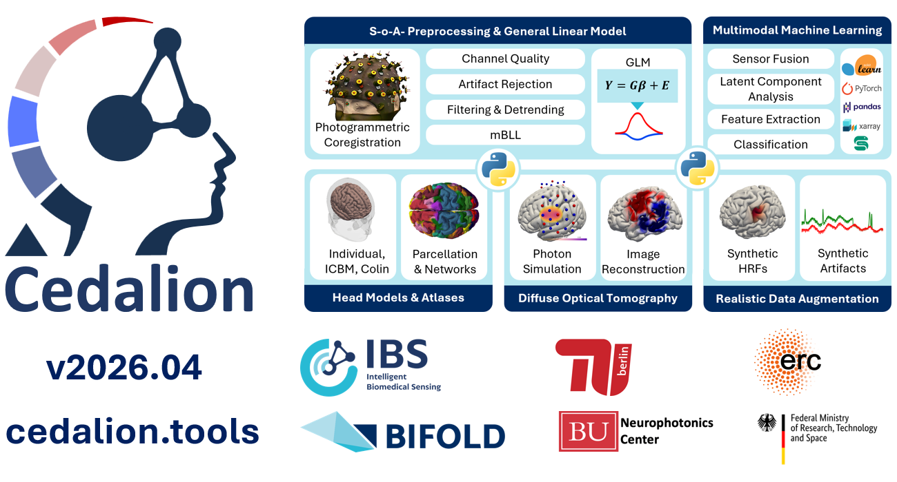

# Cedalion

A Python framework for the data-driven analysis of functional near-infrared spectroscopy
(fNIRS) and diffuse optical tomography (DOT) in naturalistic environments. Developed by
the [Intelligent Biomedical Sensing (IBS) Lab](https://www.ibs-lab.com) with and for
the community.

```{note}
You are reading the documentation for the latest development version.
Use the **version switcher** (top-left of the page) to select documentation
for a specific release that matches your installed package.
```



## What is Cedalion?

Cedalion covers the full fNIRS and DOT analysis pipeline: from raw light intensity
through signal quality assessment, preprocessing, and hemodynamic modeling to image
reconstruction and statistical inference. It is designed for researchers who want
transparent, reproducible, and extensible analysis rather than black-box processing.

The toolbox is built on a modern Python scientific stack —
[xarray](https://xarray.dev) for labeled multi-dimensional arrays,
[pint](https://pint.readthedocs.io) for physical unit tracking, and
[MNE](https://mne.tools) for EEG/fNIRS integration — and is compatible with the
[SNIRF](https://github.com/fNIRS/snirf) and [BIDS](https://bids.neuroimaging.io)
data standards. All data transformations preserve axis labels and physical units
by design, making it straightforward to trace results back to their neuroimaging origin.

## Quick Start

The following snippet loads a bundled finger-tapping dataset and converts amplitude
measurements to haemoglobin concentration in five lines:

```python
import cedalion
import cedalion.nirs.cw as nirs
import xarray as xr

rec = cedalion.data.get_fingertapping()          # load Recording (auto-downloaded)
od  = nirs.int2od(rec["amp"])                    # amplitude → optical density
dpf = xr.DataArray([6.0, 6.0], dims="wavelength",
                   coords={"wavelength": od.wavelength})
conc = nirs.od2conc(od, rec.geo3d, dpf)          # OD → HbO / HbR (µM)
```

New to Cedalion? Start with the [installation guide](getting_started/installation.md),
then work through the [tutorial notebooks](tutorial.rst). The
[concepts guide](concepts.md) explains the core data model and fNIRS terminology.

You can find the [source code on GitHub](https://github.com/ibs-lab/cedalion).

```{toctree}
:maxdepth: 1
:caption: General Info

rationale.md
getting_started/index.md
data_structures/index.md

community/index.md
../LICENSE.md
```

```{toctree}
:maxdepth: 1
:caption: ⭐ Tutorial

Paper (in prep.) <https://arxiv.org/abs/2601.05923>
Tutorial Notebooks <tutorial.rst>
```


```{toctree}
:maxdepth: 1
:caption: Package Features

data_io/index
sigproc/index
machine_learning/index
dot/index
physio/index
plot_vis/index
synth/index
```


```{toctree}
:maxdepth: 1
:caption: Reference

API reference <api/modules.rst>
Bibliography <references.rst>
All examples <examples>
```

```{toctree}
:maxdepth: 1
:caption: Project

Source code <https://github.com/ibs-lab/cedalion>
Issues <https://github.com/ibs-lab/cedalion/issues>
Documentation <https://doc.ibs.tu-berlin.de/cedalion/doc/dev/>
Changelog <CHANGELOG.md>
```

## Special Thanks
We cordially thank our friends and long-term collaborators at the BOAS Lab for their contributions and support in starting this project.


## Version
This documentation was built from commit {{commit_hash}}.
